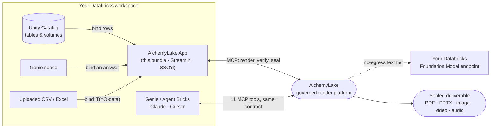
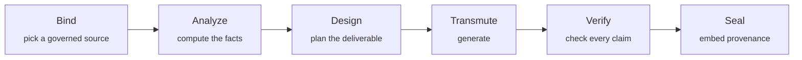

# AlchemyLake for Databricks

[](./LICENSE)
[](https://docs.databricks.com/dev-tools/cli/)
[](https://app.alchemylake.com/docs#developers)

Install a **governed creative** surface directly inside your Databricks
workspace. AlchemyLake turns the data your lakehouse already trusts into
finished deliverables **Genie doesn't make**: board-ready **PowerPoint decks
with a read-aloud script and Q&A prep under every slide**, enterprise **PDF
dossiers with a statistical appendix and an Excel evidence workbook**, designed
**infographics**, animated **video briefings with narration** (six formats),
two-host **data podcasts** (five formats), and **sonified scores** (six
genres) whose tempo follows your growth.

## Get started free — no card required

1. **[Sign up](https://app.alchemylake.com/sign-up)** — 50 free credits land in
   your account immediately, nothing to enter but an email.
2. **Grab a developer key** — sign in at [app.alchemylake.com](https://app.alchemylake.com) →
   **Studio → Developer · MCP & keys → Forge a new key** (starts with `alk_…`).
3. **Clone this repo and deploy it** into your Databricks workspace:
   ```bash
   git clone https://github.com/zorost/alchemylake-databricks.git
   cd alchemylake-databricks
   # edit the workspace host in databricks.yml (see Path 1 below), then:
   databricks bundle deploy -t prod
   databricks bundle run alchemylake_app -t prod
   ```
4. Open the App URL the CLI prints, paste your key, then **Load governed
   sources → pick one → Transmute.**

That's a governed PDF, deck, infographic, or video briefing — sealed to your
own data, running inside your own workspace — for free, in about five minutes.
No Databricks Apps on your workspace? Skip straight to
[Path 2](#path-2--register-alchemylake-as-an-mcp-server-genie--agent-bricks) —
register one URL and Genie, Claude, or Cursor get the same 50 free credits to
work with, no bundle required.

**Every lane binds to a governed source**, and the numbers discipline holds
throughout: the platform computes an analyst-grade statistical dossier from the
bound rows by code — trend with fit quality, outliers, correlations, segment
shares, concentration, pivots — the model never authors a figure, a **verifier
checks every claim after generation**, and the result is sealed (source · row
count · data sha256 · verification score) with the seal embedded in the file
itself. Genie answers bind as sources too, and one-click **recipes** ship a
board deck or a whole campaign pack from one table. Every credit accounted.

**Where Genie stops, AlchemyLake starts.** Genie answers questions about your
data inside the workspace — tables and charts. AlchemyLake takes the same
governed rows the last mile: *"Ask Genie for Q2 revenue by region, then render
an 8-slide deck titled Q2 Momentum"* leaves the workspace as a .pptx the CFO
can present cold — every figure verified against the rows, provenance sealed
into the file.

This repository **is** a self-contained **Databricks Asset Bundle**. One command
deploys a Databricks App (SSO-authenticated, running on your workspace) that
calls the AlchemyLake platform over MCP. Nothing bypasses governance: the same
credit ledger, provenance seals, and role checks that protect the web app
protect every call made from inside Databricks. Your data never leaves the
lakehouse except as the exact rows you choose to bind.

```
.
├── databricks.yml        # the Asset Bundle (App resource + targets)
├── app/
│   ├── app.py            # the Streamlit App (thin MCP client)
│   ├── app.yaml          # App runtime config (command + env)
│   └── requirements.txt
└── sql/
    └── ai_render.sql     # optional UC function: call AlchemyLake from SQL/Genie
```

---

## Three ways to use AlchemyLake with Databricks

| Path | What you get | Setup |
|---|---|---|
| **1. The App (this bundle)** | A governed render UI inside your workspace, SSO’d, next to your data | `databricks bundle deploy` |
| **2. MCP for Genie / Agent Bricks** | Every agent gains **11 governed tools** (`list_governed_sources`, `get_wallet`, `render_governed_chat`, `render_infographic`, `render_report`, `render_presentation`, `render_video_briefing`, `render_music`, `render_podcast`, `list_recipes`, `run_recipe`) — all render tools accept `source_id` for data-bound, verified output | Register one URL |
| **3. `ai_render()` in SQL** | Sealed narrative from a query or Genie space | Run `sql/ai_render.sql` |

**What agents can ship from a table** (things a Genie answer alone cannot):

- `render_presentation` — a .pptx board deck, 5–20 slides, speaker script + Q&A
  in every notes pane, AI cover art, real charts from the rows.
- `render_report` — an enterprise PDF dossier (KPI band, chart sections,
  statistical appendix, citations, methodology) **plus** an Excel evidence
  workbook: raw rows, facts, statistics, pivot, correlations.
- `render_infographic` — a designed KPI poster with the exact figures rendered
  in-image and a branded provenance strip.
- `render_video_briefing` — an animated video briefing: platform-drawn charts,
  spoken narration, motion and crossfades. Six formats (`style` param):
  consultant walkthrough, newsroom segment, executive stand-up, documentary
  deep-dive, field report, social recap.
- `render_podcast` — a two-host audio briefing with a sealed transcript. Five
  formats: two-host interview, skeptic's debate, executive stand-up, narrative
  deep-dive, plain-language walkthrough.
- `render_music` — a sonified score (tempo ↔ momentum, mode ↔ trend) plus the
  literal data-motif WAV of the rows. Six genres: cinematic score, corporate
  uplift, ambient data fields, electronic pulse, orchestral arc, lo-fi data
  study.

Prefer plain REST? The same keys work on the public API:
`https://app.alchemylake.com/api/public/v1` (OpenAPI at `/api/public/v1/openapi.json`).

---

## How it fits together

AlchemyLake never runs *inside* this bundle — the App is a thin, SSO'd client that
calls the governed platform over HTTPS/MCP. Your tables stay in your lakehouse; only
the exact rows you bind for a given render ever leave the workspace, and only to
produce that one sealed deliverable.



Every render — from the App, from an agent, or from `ai_render()` in SQL — goes
through the same discipline before it comes back:



The model is never the source of a number — every figure is computed from your rows
first, and whatever the render says is checked against those figures afterward. The
seal (source · row count · data hash · verification score) rides embedded in the file
itself, in every format, so it survives being forwarded, downloaded, or printed.

### Beyond a Genie answer

| | Genie alone | Genie / Agent Bricks + AlchemyLake |
|---|:---:|:---:|
| Answers a question inside the workspace | ✅ | ✅ |
| Ships a board-ready **.pptx** with a read-aloud script + Q&A prep per slide | | ✅ |
| Ships an enterprise **PDF dossier + Excel evidence workbook** | | ✅ |
| Ships a designed **infographic** with figures rendered in-image | | ✅ |
| Ships a narrated **video briefing** or two-host **podcast** | | ✅ |
| Every number checked against the source *after* generation and scored | | ✅ |
| Provenance (source, rows, hash, score) embedded in the output file | | ✅ |
| Metered by an auditable, per-render credit ledger | | ✅ |

### What people actually ask it for

Every lane binds to a governed source, so the figures in the output are the figures
in your table — not a paraphrase. A sample of real workflows across the seven lanes:

| Lane | Ships | Example asks |
|---|---|---|
| **Analyst** (chat) | A sealed, sourced answer | *"Draft the board narrative from the certified loan book."* · *"This month's ridership performance, in the agency's voice."* |
| **Infographic** | A KPI poster, figures rendered in-image | *"This week's sales milestone, ready for social."* · *"'45 days without a recordable incident' for the plant floor."* |
| **Report** | PDF dossier + Excel evidence workbook | *"Quarterly board-packet narrative, sealed."* · *"Compliance rollup with a hash of the source data baked in."* |
| **Presentation** | .pptx, speaker script + Q&A per slide | *"QBR deck with the CRM's exact numbers."* · *"Steering-committee deck anyone on the team can present cold."* |
| **Video briefing** | A narrated, animated data video | *"All-hands opener with the real ARR on screen."* · *"30-second earnings-day teaser, safe to post at the bell."* |
| **Music** | A score that follows the actual trend | *"A launch-video bed whose tempo rises with the real growth curve."* |
| **Podcast** | A two-host audio briefing + transcript | *"A 3-minute briefing leadership can play on the commute."* · *"An audio version of the same sealed report, for accessibility."* |

Free to try: [sign up](https://app.alchemylake.com/sign-up) for 50 credits, no card
required, and point this bundle at your own key.

---

## Prerequisites

1. **Databricks CLI ≥ 0.230** and authentication to your workspace:
   ```bash
   databricks auth login --host https://<your-workspace>.cloud.databricks.com
   ```
2. **Databricks Apps enabled** on the workspace (Premium/Enterprise).
3. An **AlchemyLake developer key** (`alk_…`): [sign up free](https://app.alchemylake.com/sign-up)
   (50 credits, no card required) or sign in at <https://app.alchemylake.com> →
   **Studio → Developer · MCP & keys → Forge a new key**.

---

## Path 1 — Deploy the App (one command)

First set your workspace host in `databricks.yml` — replace the
`your-workspace…` placeholder under **both** `targets.dev` and `targets.prod`
(run `databricks auth profiles` if you need to find it). Then:

```bash
databricks bundle deploy -t prod                 # upload source + create the App
databricks bundle run alchemylake_app -t prod    # start it; prints the App URL
```

> **CLI note (Terraform pin).** Some Databricks CLI builds download a Terraform
> whose signing key has expired, which breaks `bundle deploy`. If you hit that,
> point the CLI at a local Terraform binary and pin the version to match it:
> ```bash
> export DATABRICKS_TF_EXEC_PATH="$(command -v terraform)"
> export DATABRICKS_TF_VERSION="1.9.8"   # set to your local `terraform version`
> ```
> This is the exact, verified path AlchemyLake's own reference App is deployed
> with — it runs live in-workspace as a Streamlit App under SSO.

Open the App URL that the CLI prints. Paste your `alk_…` key in the sidebar
(or bind it from a secret — see below), then **Load governed sources → pick one
→ Transmute**. Every result carries its provenance seal.

The pasted key is remembered in that browser (client-side only, until cleared
or replaced) so it survives a refresh — a workspace-bound secret still always
takes priority. The App also carries a self-contained **Docs** tab and an
expanded **About / Install** tab (how to use it, why the verification model
matters, where the render compute actually runs, and the fastest path to a
key) so it's useful even where the public docs site isn't reachable.

### Bind the key from a secret (recommended for teams)

So analysts never paste a key:

```bash
databricks secrets create-scope alchemylake
databricks secrets put-secret alchemylake api_key      # paste alk_...
```

Then uncomment the `ALCHEMYLAKE_API_KEY` / `valueFrom` block in
`app/app.yaml` and `databricks.yml`, and redeploy.

---

## Path 2 — Register AlchemyLake as an MCP server (Genie / Agent Bricks)

No bundle required. In your agent/MCP client configuration add:

```json
{
  "mcpServers": {
    "alchemylake": {
      "url": "https://app.alchemylake.com/api/mcp",
      "headers": { "Authorization": "Bearer alk_YOUR_KEY" }
    }
  }
}
```

Genie / Agent Bricks, Claude, and Cursor will discover the eleven tools
automatically. Ask, for example: *“Using AlchemyLake, write a sealed 3-bullet
executive summary of `gold_ridership_national_monthly`”* — or go bigger:
*“Render an 8-slide presentation of that table titled Ridership Momentum”*
(a .pptx with a presenter script under every slide), or *“Run the
campaign-pack recipe”* (`run_recipe` renders the poster, the report, and the
copy in one call, all verified and sealed).

---

## Path 3 — `ai_render()` in SQL / Genie

Edit `sql/ai_render.sql` (set your catalog/schema) and run it in a SQL editor
on **serverless compute with external network access enabled**. Then:

```sql
SELECT ai_render(
  'One-sentence executive read of this quarter''s ridership',
  'ntd_demo.ntd.gold_ridership_national_monthly'
) AS narrative;
```

See the header of `sql/ai_render.sql` for the network-egress and secret
prerequisites, and the MCP fallback if egress cannot be enabled.

---

## Validate before deploying

```bash
databricks bundle validate -t prod
```

---

## FAQ

**Does my data leave the lakehouse?** Only the exact rows you bind for a given
render are sent to produce that render — nothing else is read, and bound data is
never used to train models. A no-egress **text tier** can route even that narrative
step to your own Databricks Foundation Model endpoint instead; see
[the residency docs](https://app.alchemylake.com/docs#residency).

**Do I need Databricks Apps enabled for this?** Only for Path 1 (the App). Path 2
(MCP) and Path 3 (`ai_render()`) need nothing beyond CLI/SQL access and a developer
key — no App, no extra compute resource.

**Can agents use this without a human in the loop?** Yes — that's Path 2. Register
`/api/mcp` once and Genie, Agent Bricks, Claude, and Cursor all gain the same eleven
governed tools, metered and sealed exactly like the UI.

**Is AlchemyLake a Databricks product?** No. AlchemyLake is an independent platform
by [Zorost Intelligence](mailto:info@zorost.com) that plugs into Databricks; this
repository is Apache-2.0 licensed and is how it plugs in. The hosted platform it
talks to is a separate, metered service (50 free credits to start, no card
required).

**What does this bundle actually contain?** Only a Streamlit client (`app/app.py`),
its App runtime config, and an optional SQL function — everything under
[`sql/`](./sql) and [`app/`](./app). It holds no model weights, no proprietary
rendering code, and no secrets; it is a thin, auditable client over the same MCP/REST
contract documented at [app.alchemylake.com/docs](https://app.alchemylake.com/docs).

**Something's broken.** Open an issue in this repository, or email
info@zorost.com — see [`SECURITY.md`](./SECURITY.md) for vulnerability reports
specifically.

---

## Uninstall

```bash
databricks bundle destroy -t prod
```

---

*AlchemyLake is a product of **Zorost Intelligence**. Platform docs:
<https://app.alchemylake.com/docs>. Support: info@zorost.com.*
