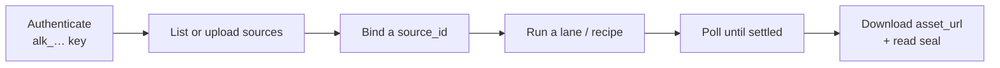

# AlchemyLake Developer Guide — CLI, REST API & MCP

*Governed data in, provenance-sealed deliverables out — from your terminal,
your code, your agents, and your IDE.*

This guide is for three audiences:

| Audience | You want to… | Start here |
|---|---|---|
| **User** | Run a few commands, upload a file, get a report | §2 Access → §4 CLI quick start |
| **Developer** | Automate renders from scripts, CI, or a small app | §5 REST API → §8 Use cases |
| **Advanced** | Wire agents, Genie One, multi-step pipelines | §6 MCP → §7 VS Code & agents → §9 Advanced |

**One key opens three doors.** A single developer key (`alk_…`) authenticates
the CLI, the public REST API, and the MCP server. Everything bills the same
credit wallet and returns the same provenance seal.

---

## 1. The mental model

Every integration follows the same loop:



1. **Authenticate** — `Authorization: Bearer alk_…`
2. **Bind data** — pick a governed source (`up.…` upload, `genie:…` Genie
   space, Unity Catalog table, or a built-in sample)
3. **Run a lane** — chat, deep_research, report, deck, image, video, music,
   voice (podcast), or a one-click recipe
4. **Receive** — signed URLs (~1 hour), output text, provenance seal, and a
   verification score

Failed runs are **auto-refunded**. Long lanes (video, music, deep research)
can take several minutes — poll until `status` is `succeeded` or `failed`.

### The eight lanes + recipes

| Lane (`kind`) | Credits | Output |
|---|---|---|
| `chat` | 1 (6 with council) | Verified analyst answer |
| `deep_research` | 18 | PDF dossier + Excel evidence workbook |
| `report` | 10 | Enterprise PDF + evidence workbook |
| `deck` | 40 base (+4/slide over 5) | PowerPoint with speaker notes |
| `image` | 45 | Designed data infographic |
| `video` | 40 | Animated data video (mp4) |
| `voice` | 25 | Two-host podcast (mp3) + transcript |
| `music` | 50 | Sonified score + data-motif WAV |

**Recipes** (one-click presets): `kpi_poster`, `one_pager`, `social_copy`,
`board_deck`, `data_briefing`, `boardroom_briefing`, `data_score`,
`campaign_pack` (runs three pieces).

---

## 2. Getting access

### Step 1 — Create an account

1. Go to [app.alchemylake.com/sign-up](https://app.alchemylake.com/sign-up)
2. New accounts receive **50 free credits** (no card required)

### Step 2 — Forge a developer key

1. Sign in → **Studio** → left rail → **Developer · MCP & keys**
2. Press **Forge a new key**
3. Copy the `alk_…` key — **shown once**, then hashed at rest
4. Revoke anytime from the same panel

### Step 3 — Store the key securely

**Terminal (recommended for local dev):**

```bash
# add to ~/.zshrc or ~/.bashrc
export ALCHEMYLAKE_API_KEY="alk_YOUR_KEY_HERE"
```

**Per-command (CI, one-offs):**

```bash
alchemylake me --key alk_YOUR_KEY_HERE
```

**Never commit keys.** Use environment variables or your platform's secret store.

### Step 4 — Verify

```bash
# CLI
npx alchemylake me

# REST
curl -s https://app.alchemylake.com/api/public/v1/me \
  -H "Authorization: Bearer $ALCHEMYLAKE_API_KEY"

# Health (no auth)
curl -s https://app.alchemylake.com/api/health
# → {"web":"ok","api":"ok"}
```

---

## 3. Which door should you use?

| Door | Best for | Install | Scriptable |
|---|---|---|---|
| **CLI** (`npx alchemylake`) | Shell scripts, quick renders, local automation | Node 18+, zero deps | `--json` + `jq` |
| **REST API** (`/api/public/v1`) | Any language, web apps, CI/CD, mobile | `curl`, `fetch`, SDKs | OpenAPI spec |
| **MCP** (`/api/mcp`) | AI agents — Cursor, Claude, Genie One, custom bots | MCP client config | Agent decides |

All three hit the same backend. Pick the one your environment already speaks.

**Base URLs:**

| Surface | URL |
|---|---|
| Public REST API | `https://app.alchemylake.com/api/public/v1` |
| OpenAPI spec | `https://app.alchemylake.com/api/public/v1/openapi.json` |
| MCP server | `https://app.alchemylake.com/api/mcp` |
| Web Studio | `https://app.alchemylake.com/studio` |
| Docs | `https://app.alchemylake.com/docs` |

---

## 4. The CLI — full reference

### Install

```bash
npx alchemylake --help          # zero-install (recommended)
npm i -g alchemylake            # global install
```

Requires **Node 18+** (uses built-in `fetch`). Zero npm dependencies.

### Global flags

| Flag | Purpose |
|---|---|
| `--key alk_…` | API key (or `ALCHEMYLAKE_API_KEY` env var) |
| `--json` | Raw JSON output for scripting |
| `--base <url>` | Override API base (default: public v1) |
| `--no-wait` | Queue and exit immediately |

### Commands

```bash
alchemylake me                              # wallet, role, residency
alchemylake sources                         # list governed sources
alchemylake upload <file>                   # register BYO data
alchemylake rates                           # live credit rate-card
alchemylake recipes                         # one-click template catalog
alchemylake render <kind> [flags]           # run a lane
alchemylake recipe <id> [flags]             # run a template
alchemylake status <generation_id>          # poll one run
alchemylake vault [--limit n]               # recent generations
```

### Upload your data (no Databricks required)

```bash
alchemylake upload ./q3-actuals.xlsx
# → registered: up.1a2b3c ("q3-actuals", 812 rows × 9 cols)

alchemylake upload ./board-memo.pdf
# → documents bind as a sectioned corpus when no table is found
```

Accepted: `.csv` `.tsv` `.xlsx` `.xlsm` `.xls` `.pdf` `.docx` `.txt` `.md`
(≤ 6 MB).

### Render examples — every lane

```bash
SOURCE=up.1a2b3c   # replace with your source id from `alchemylake sources`

# Analyst (1 credit) — ask your data anything
alchemylake render chat \
  --prompt "Summarize this quarter in 3 bullets with exact figures" \
  --source $SOURCE

# Continue a Genie conversation (pass thread_id from the previous run)
alchemylake render chat \
  --prompt "Now break that down by region" \
  --source genie:dbx1 --thread th_abc123

# Multi-model panel for high-stakes copy (6 credits)
alchemylake render chat \
  --prompt "Write the board opening paragraph" \
  --source $SOURCE --council

# Deep Research (18 credits) — multi-step investigation
alchemylake render deep_research \
  --prompt "Why did Q3 dip, and what should we do about it?" \
  --source $SOURCE

# Report (10 credits) — PDF + Excel evidence workbook
alchemylake render report \
  --prompt "Board brief — lead with the strongest region" \
  --source $SOURCE

# Presentation (40 credits, 5 slides; +4 cr per extra slide)
alchemylake render deck \
  --prompt "QBR — momentum story" \
  --source $SOURCE --slides 8 --title "Q3 Momentum"

# Infographic (45 credits)
alchemylake render image \
  --prompt "Bold KPI poster — headline stat front and center" \
  --source $SOURCE

# Video briefing (40 credits)
alchemylake render video \
  --prompt "45-second executive briefing" \
  --source $SOURCE --style newsroom_segment

# Podcast (25 credits)
alchemylake render voice \
  --prompt "Two-host briefing on this quarter's numbers" \
  --source $SOURCE --style two_host_interview

# Music (50 credits)
alchemylake render music \
  --prompt "Score the momentum arc" \
  --source $SOURCE --style cinematic_score
```

**Video styles:** `consultant_walkthrough`, `newsroom_segment`,
`executive_standup`, `documentary_deepdive`, `field_report`, `social_recap`

**Music styles:** `cinematic_score`, `corporate_uplift`, `ambient_dataviz`,
`electronic_pulse`, `orchestral_arc`, `lofi_data_study`

**Podcast styles:** `two_host_interview`, `skeptics_debate`,
`executive_standup`, `narrative_deepdive`, `plain_language_walkthrough`

### One-click recipes

```bash
alchemylake recipe kpi_poster --source $SOURCE
alchemylake recipe one_pager --source $SOURCE --prompt "Emphasize EMEA"
alchemylake recipe board_deck --source $SOURCE
alchemylake recipe data_briefing --source $SOURCE
alchemylake recipe boardroom_briefing --source $SOURCE
```

### Scripting with `--json` and `jq`

```bash
# Queue a report, extract the PDF URL when done
alchemylake render report \
  --prompt "Weekly brief" --source $SOURCE --json \
  | jq -r '.asset_url'

# List recent runs and grab the latest asset
alchemylake vault --limit 5 --json | jq -r '.[0].asset_url'

# Poll a specific generation
alchemylake status GEN_ID --json | jq '.status, .asset_url'

# Fire-and-forget (poll yourself)
alchemylake render video --prompt "Briefing" --source $SOURCE --no-wait --json \
  | jq -r '.id' | xargs -I{} alchemylake status {}
```

### Shell script — weekly board pack

```bash
#!/usr/bin/env bash
set -euo pipefail
: "${ALCHEMYLAKE_API_KEY:?set ALCHEMYLAKE_API_KEY}"

SOURCE=$(npx alchemylake sources --json | jq -r '.[0].id')
OUTDIR=./board-pack-$(date +%Y%m%d)
mkdir -p "$OUTDIR"

echo "Binding $SOURCE …"

PDF=$(npx alchemylake render report \
  --prompt "Weekly board brief — lead with the headline KPI" \
  --source "$SOURCE" --json | jq -r '.asset_url')

PPTX=$(npx alchemylake render deck \
  --prompt "Board meeting deck" \
  --source "$SOURCE" --slides 8 --json | jq -r '.asset_url')

curl -fsSL "$PDF" -o "$OUTDIR/brief.pdf"
curl -fsSL "$PPTX" -o "$OUTDIR/deck.pptx"
echo "Done → $OUTDIR"
```

---

## 5. The REST API — full reference

**Base:** `https://app.alchemylake.com/api/public/v1`
**Auth:** `Authorization: Bearer alk_…`
**Spec:** [openapi.json](https://app.alchemylake.com/api/public/v1/openapi.json)

### Endpoints

| Method | Path | What it does |
|---|---|---|
| `GET` | `/me` | Wallet balance, role, text residency |
| `GET` | `/sources` | List governed sources |
| `POST` | `/sources` | Upload a file (base64) → new `up.…` id |
| `GET` | `/rates` | Live credit rate-card |
| `GET` | `/recipes` | One-click template catalog |
| `POST` | `/generations` | Create a render (any lane or recipe) |
| `GET` | `/generations` | List recent generations (`?limit=40`) |
| `GET` | `/generations/{id}` | Fetch one generation (poll until settled) |

### Create a generation

```bash
curl -s https://app.alchemylake.com/api/public/v1/generations \
  -H "Authorization: Bearer $ALCHEMYLAKE_API_KEY" \
  -H "Content-Type: application/json" \
  -d '{
    "kind": "report",
    "prompt": "Board brief — lead with the strongest region",
    "source_id": "up.1a2b3c"
  }'
```

**Request body fields:**

| Field | Required | Description |
|---|---|---|
| `prompt` | Yes | The brief / data question |
| `kind` | No (default `chat`) | Lane: `chat`, `deep_research`, `image`, `video`, `music`, `voice`, `report`, `deck` |
| `source_id` | For bound lanes | Governed source id |
| `recipe` | Instead of `kind` | Recipe id (e.g. `kpi_poster`) |
| `options` | No | Lane-specific options (see below) |
| `wait` | No (default `true`) | `false` → return immediately as `running`; poll `GET /generations/{id}` |

**`options` object:**

| Key | Lanes | Description |
|---|---|---|
| `thread_id` | chat | Continue an analyst session (Genie keeps context) |
| `council` | chat | Multi-model panel (6 credits) |
| `compare_source_id` | chat | Second source for comparative run |
| `slides` | deck | Slide count (3–20) |
| `title` | deck | Cover slide title |
| `style` | video, music, voice | Format/genre id (see CLI §4) |
| `aspect_ratio` | image | e.g. `4:3`, `16:9` |

### Upload a file via REST

```bash
curl -s https://app.alchemylake.com/api/public/v1/sources \
  -H "Authorization: Bearer $ALCHEMYLAKE_API_KEY" \
  -H "Content-Type: application/json" \
  -d "{
    \"filename\": \"q3.csv\",
    \"content_base64\": \"$(base64 -i q3.csv | tr -d '\n')\",
    \"name\": \"Q3 actuals\",
    \"description\": \"Quarterly revenue by region\"
  }"
# → {"ok":true,"id":"up.abc123","name":"Q3 actuals","row_count":812,...}
```

### Async pattern — queue then poll

Long lanes (video, music, deep research) can take 3–9 minutes. For
serverless timeouts, use `wait: false`:

```bash
# 1. Queue
GEN=$(curl -s https://app.alchemylake.com/api/public/v1/generations \
  -H "Authorization: Bearer $ALCHEMYLAKE_API_KEY" \
  -H "Content-Type: application/json" \
  -d '{"kind":"video","prompt":"Exec briefing","source_id":"up.abc","wait":false}' \
  | jq -r '.id')

# 2. Poll until settled
while true; do
  STATUS=$(curl -s "https://app.alchemylake.com/api/public/v1/generations/$GEN" \
    -H "Authorization: Bearer $ALCHEMYLAKE_API_KEY" | jq -r '.status')
  echo "status: $STATUS"
  [ "$STATUS" != "running" ] && [ "$STATUS" != "queued" ] && break
  sleep 5
done

# 3. Download
curl -s "https://app.alchemylake.com/api/public/v1/generations/$GEN" \
  -H "Authorization: Bearer $ALCHEMYLAKE_API_KEY" | jq -r '.asset_url'
```

### Response shape (Generation)

```json
{
  "id": "gen_abc123",
  "kind": "report",
  "status": "succeeded",
  "output_text": "Executive summary …",
  "asset_url": "https://…signed-url…/brief.pdf",
  "extra_files": [
    { "slot": "workbook", "label": "Evidence workbook (Excel)", "url": "https://…" }
  ],
  "credits_charged": 10,
  "thread_id": "th_abc123",
  "source_refs": [
    {
      "source_id": "up.1a2b3c",
      "name": "Q3 actuals",
      "origin": "uploaded",
      "row_count": 812,
      "data_sha256": "a1b2c3…"
    }
  ],
  "verification": { "checked": 14, "verified": 14, "score": 1.0 },
  "created_at": "2026-07-07T07:00:00Z"
}
```

### Python example

```python
#!/usr/bin/env python3
"""Minimal AlchemyLake client — upload, render, download."""
import base64, json, os, sys, time, urllib.request

API = "https://app.alchemylake.com/api/public/v1"
KEY = os.environ["ALCHEMYLAKE_API_KEY"]

def api(method, path, body=None):
    req = urllib.request.Request(
        f"{API}{path}",
        data=json.dumps(body).encode() if body else None,
        headers={"Authorization": f"Bearer {KEY}", "Content-Type": "application/json"},
        method=method,
    )
    with urllib.request.urlopen(req) as resp:
        return json.loads(resp.read())

# Upload
with open("q3.csv", "rb") as f:
    src = api("POST", "/sources", {
        "filename": "q3.csv",
        "content_base64": base64.b64encode(f.read()).decode(),
    })
print(f"Source: {src['id']} ({src['row_count']} rows)")

# Render
gen = api("POST", "/generations", {
    "kind": "report",
    "prompt": "Board brief — lead with the strongest region",
    "source_id": src["id"],
    "wait": False,
})
gen_id = gen["id"]
print(f"Queued: {gen_id}")

# Poll
while True:
    g = api("GET", f"/generations/{gen_id}")
    if g["status"] not in ("running", "queued"):
        break
    print(f"  … {g['status']}")
    time.sleep(5)

if g["status"] == "failed":
    sys.exit(f"Failed: {g.get('error')}")

print(f"PDF: {g['asset_url']}")
for f in g.get("extra_files") or []:
    print(f"  {f['label']}: {f['url']}")
```

### Node.js / TypeScript example

```typescript
const API = "https://app.alchemylake.com/api/public/v1";
const KEY = process.env.ALCHEMYLAKE_API_KEY!;

async function api(path: string, opts: RequestInit = {}) {
  const resp = await fetch(`${API}${path}`, {
    ...opts,
    headers: {
      Authorization: `Bearer ${KEY}`,
      "Content-Type": "application/json",
      ...opts.headers,
    },
  });
  if (!resp.ok) throw new Error(`${resp.status}: ${await resp.text()}`);
  return resp.json();
}

// Render and poll
const queued = await api("/generations", {
  method: "POST",
  body: JSON.stringify({
    kind: "deep_research",
    prompt: "Why did Q3 dip?",
    source_id: "up.1a2b3c",
    wait: false,
  }),
});

let gen = queued;
while (gen.status === "running" || gen.status === "queued") {
  await new Promise((r) => setTimeout(r, 5000));
  gen = await api(`/generations/${queued.id}`);
}

console.log(gen.asset_url);
```

---

## 6. MCP — full reference

**URL:** `https://app.alchemylake.com/api/mcp`
**Transport:** Streamable HTTP (JSON-RPC 2.0 over POST)
**Auth:** `Authorization: Bearer alk_…` on every tool call
**Discovery** (`initialize`, `tools/list`) is open; execution requires a key.

### The 13 tools

| Tool | Credits | What it does |
|---|---|---|
| `list_governed_sources` | free | Sources visible to your account |
| `upload_source` | free | Register BYO data (base64) |
| `get_wallet` | free | Credit balance |
| `list_recipes` | free | Template catalog |
| `render_governed_chat` | 1 (6 council) | Analyst answer, sealed |
| `render_deep_research` | 18 | Multi-step investigation dossier |
| `render_report` | 10 | PDF + evidence workbook |
| `render_presentation` | 40+ | PowerPoint with speaker notes |
| `render_infographic` | 45 | Designed data poster |
| `render_video_briefing` | 40 | Animated data video |
| `render_music` | 50 | Sonified score |
| `render_podcast` | 25 | Two-host audio briefing |
| `run_recipe` | varies | One-click template |

Every render tool accepts `source_id`. Chat also accepts `thread_id`
(continues Genie conversations), `council`, and `compare_source_id`.

### Raw MCP call (curl)

```bash
# List tools (no auth needed)
curl -s https://app.alchemylake.com/api/mcp \
  -H "Content-Type: application/json" \
  -d '{"jsonrpc":"2.0","id":1,"method":"tools/list"}' \
  | jq '.result.tools[].name'

# Render a report
curl -s https://app.alchemylake.com/api/mcp \
  -H "Content-Type: application/json" \
  -H "Authorization: Bearer $ALCHEMYLAKE_API_KEY" \
  -d '{
    "jsonrpc": "2.0",
    "id": 2,
    "method": "tools/call",
    "params": {
      "name": "render_report",
      "arguments": {
        "prompt": "Board brief — lead with the strongest region",
        "source_id": "up.1a2b3c"
      }
    }
  }' | jq -r '.result.content[0].text'
```

### Databricks Genie One / Agent Bricks

In your Databricks workspace:

1. Open your agent → **Tools** → **Add MCP server**
2. Register:

```yaml
url: https://app.alchemylake.com/api/mcp
transport: streamable-http
headers:
  Authorization: Bearer alk_YOUR_KEY
```

3. Ask the agent: *"Using my governed sources, create a board-ready report
   on Q3 revenue by region."*
4. The agent calls `list_governed_sources` → `render_report` → returns signed
   URLs with the provenance seal.

The same snippet is copyable from **Studio → Developer → ◈ Wire into Genie
One / Agent Bricks**.

---

## 7. VS Code, Cursor & other MCP clients

### Cursor (recommended — built-in MCP support)

1. Open **Cursor Settings** → **MCP** (or edit the config file directly)
2. Add the AlchemyLake server:

**macOS / Linux** — `~/.cursor/mcp.json`:

```json
{
  "mcpServers": {
    "alchemylake": {
      "url": "https://app.alchemylake.com/api/mcp",
      "headers": {
        "Authorization": "Bearer alk_YOUR_KEY"
      }
    }
  }
}
```

**Windows** — `%USERPROFILE%\.cursor\mcp.json` (same JSON).

3. Restart Cursor (or reload MCP servers from settings)
4. In any chat, the agent can now call AlchemyLake tools

**Example prompts in Cursor:**

> "List my governed sources, then create a board-ready PDF report on the
> strongest region from my Q3 upload."

> "Upload `./data/q3.xlsx` to AlchemyLake, then run deep research on why
> margin compressed."

> "Render a newsroom-style video briefing from my Genie source."

The agent will call `list_governed_sources`, `upload_source`, or
`render_*` tools automatically. You see the seal and signed URLs in the
response.

### VS Code with GitHub Copilot (MCP extension)

VS Code supports MCP through the **MCP for VS Code** extension (or Copilot's
agent mode when MCP is enabled in your VS Code build).

1. Install the MCP extension from the VS Code marketplace
2. Open **Settings** → search "MCP" → edit the MCP servers config
3. Add the same JSON block as Cursor above
4. In Copilot Chat (agent mode), ask the same kinds of questions

If your VS Code build does not yet expose MCP settings, use the **CLI** or
**REST API** from the integrated terminal instead — same key, same results.

### Claude Desktop

Edit `~/Library/Application Support/Claude/claude_desktop_config.json`
(macOS) or `%APPDATA%\Claude\claude_desktop_config.json` (Windows):

```json
{
  "mcpServers": {
    "alchemylake": {
      "url": "https://app.alchemylake.com/api/mcp",
      "headers": {
        "Authorization": "Bearer alk_YOUR_KEY"
      }
    }
  }
}
```

Restart Claude Desktop. The tools appear in the hammer-icon tool picker.

### Windsurf / other MCP-capable editors

Any editor that supports **HTTP MCP** (streamable HTTP transport) uses the
same config block. Point it at `https://app.alchemylake.com/api/mcp` with
your `alk_…` bearer token.

### VS Code terminal workflow (no MCP needed)

If you prefer not to configure MCP, the integrated terminal works identically:

```bash
# Terminal → set key once per session
export ALCHEMYLAKE_API_KEY=alk_YOUR_KEY

# Run from the VS Code terminal
npx alchemylake sources
npx alchemylake render report --prompt "Board brief" --source up.abc123
```

Add a **`.vscode/tasks.json`** for one-click renders:

```json
{
  "version": "2.0.0",
  "tasks": [
    {
      "label": "AlchemyLake: weekly board brief",
      "type": "shell",
      "command": "npx alchemylake render report --prompt 'Weekly board brief' --source ${input:sourceId}",
      "options": { "env": { "ALCHEMYLAKE_API_KEY": "${env:ALCHEMYLAKE_API_KEY}" } },
      "problemMatcher": []
    }
  ],
  "inputs": [
    { "id": "sourceId", "type": "promptString", "description": "Source id (e.g. up.abc123)" }
  ]
}
```

Run via **Terminal → Run Task…**.

---

## 8. Use cases — end-to-end workflows

### Use case 1 — Analyst with no Databricks (upload → chat)

**Who:** A PM with a CSV export, no lakehouse access.
**Door:** CLI or Studio.

```bash
npx alchemylake upload ./weekly-metrics.csv
npx alchemylake sources    # copy the up.… id
npx alchemylake render chat \
  --prompt "What changed week over week? Name the biggest mover." \
  --source up.abc123
```

### Use case 2 — Board pack from Genie (Databricks user)

**Who:** A data lead with a curated Genie space.
**Door:** CLI, MCP (via Cursor), or Studio.

Prerequisite: connect your workspace in Studio → Databricks (see
[GENIE_GUIDE.md](./GENIE_GUIDE.md)).

```bash
# Genie source id comes from `alchemylake sources` (genie:<connection_id>)
npx alchemylake render report \
  --prompt "Revenue by region last 6 quarters — board-ready brief" \
  --source genie:dbx1

npx alchemylake render deck \
  --prompt "QBR deck — lead with headline KPI" \
  --source genie:dbx1 --slides 8
```

### Use case 3 — Deep investigation dossier

**Who:** A strategy team asking "why" and "what should we do."
**Door:** CLI, REST, MCP, or Databricks App.

```bash
npx alchemylake render deep_research \
  --prompt "Why did margin compress in Q3, which segments drove it, and what should we do?" \
  --source up.abc123
# → sealed PDF dossier + Excel evidence workbook
```

### Use case 4 — Agent-driven pipeline (Cursor + MCP)

**Who:** A developer who wants the AI to handle the whole flow.
**Door:** MCP in Cursor.

1. Configure MCP (§7)
2. Prompt:

> "Check my AlchemyLake wallet, list my sources, upload `data/q3.xlsx` if
> it's not there yet, then render a deep-research dossier investigating
> why Q3 revenue dipped. Give me the PDF URL when it's done."

The agent chains: `get_wallet` → `list_governed_sources` → `upload_source`
→ `render_deep_research` → returns signed URLs + seal.

### Use case 5 — CI/CD weekly report (GitHub Actions)

**Who:** A data team that wants a fresh PDF every Monday.
**Door:** REST API or CLI in CI.

```yaml
# .github/workflows/weekly-brief.yml
name: Weekly board brief
on:
  schedule:
    - cron: "0 8 * * 1"   # Mondays 08:00 UTC
  workflow_dispatch:

jobs:
  brief:
    runs-on: ubuntu-latest
    steps:
      - uses: actions/setup-node@v4
        with: { node-version: "20" }
      - name: Render report
        env:
          ALCHEMYLAKE_API_KEY: ${{ secrets.ALCHEMYLAKE_API_KEY }}
          SOURCE_ID: up.abc123
        run: |
          URL=$(npx alchemylake render report \
            --prompt "Weekly board brief — lead with headline KPI" \
            --source "$SOURCE_ID" --json | jq -r '.asset_url')
          curl -fsSL "$URL" -o brief.pdf
      - uses: actions/upload-artifact@v4
        with: { name: board-brief, path: brief.pdf }
```

Store `ALCHEMYLAKE_API_KEY` in **GitHub → Settings → Secrets**.

### Use case 6 — Databricks App (in-workspace UI)

**Who:** Anyone in the workspace who prefers a browser UI over CLI.
**Door:** The Streamlit app deployed via Databricks Asset Bundle.

```bash
# One-time deploy (workspace admin)
cd databricks
databricks bundle deploy -t prod --profile YOUR_PROFILE
databricks bundle run alchemylake_app -t prod --profile YOUR_PROFILE
```

Open the app URL, paste your `alk_…` key in the sidebar, and use every lane
from the tabs (Analyst, Deep Research, Report, Presentation, etc.). The app
calls the same MCP endpoint under the hood.

### Use case 7 — Campaign pack (three deliverables, one source)

```bash
# Run each piece of the campaign pack individually
for recipe in kpi_poster one_pager social_copy; do
  npx alchemylake recipe "$recipe" --source up.abc123
done
```

---

## 9. Advanced topics

### Genie sources via API/CLI

Genie sources appear as `genie:<connection_id>` in `sources`. They are
**dynamic** — your prompt is sent to Genie as the data question, Genie runs
governed SQL in your workspace, and the result table becomes the bound source.

```bash
# First question
npx alchemylake render chat \
  --prompt "Total revenue by region for the last 6 quarters" \
  --source genie:dbx1 --json | tee /tmp/gen1.json

# Follow-up (same Genie conversation)
THREAD=$(jq -r '.thread_id' /tmp/gen1.json)
npx alchemylake render chat \
  --prompt "Now show year-over-year change by region" \
  --source genie:dbx1 --thread "$THREAD"
```

On craft lanes (report, video, etc.), if your prompt is pure direction, the
platform auto-distills a data question and retries once. Lead with a concrete
ask for best results: *"Revenue by region, last 6 quarters — board-ready
report."*

See [GENIE_GUIDE.md](./GENIE_GUIDE.md) for the full Genie integration guide.

### Comparative analyst runs

```bash
npx alchemylake render chat \
  --prompt "Contrast these two sources — where do they agree and diverge?" \
  --source up.abc123 --compare up.def456
```

### Polling vs blocking

| Mode | When to use | How |
|---|---|---|
| **Blocking** (default) | CLI local dev, short lanes | CLI polls automatically; API `wait: true` |
| **Async** | CI, serverless, long lanes | `--no-wait` / `wait: false`, then poll |

### Rate limits and errors

| HTTP | Meaning | Action |
|---|---|---|
| `401` | Missing/invalid key | Check `alk_…` key; re-forge if revoked |
| `402` | Insufficient credits | Buy credits in Studio |
| `422` | Safety block | Rephrase the prompt |
| `429` | Rate limit | Back off and retry |
| `502` | Source unavailable (Genie miss) | Rephrase with a concrete data ask |

### Asset URLs expire

Signed URLs last ~1 hour. Download promptly, or re-fetch via
`alchemylake vault` / `GET /generations/{id}` to get a fresh URL.

### Text residency

Accounts with a Databricks connection can set **text residency** to
`workspace` in Studio settings — reasoning runs on your Foundation Model
endpoint instead of the platform tier. Check with `alchemylake me`.

---

## 10. Quick reference card

```bash
# ── Setup ──
export ALCHEMYLAKE_API_KEY=alk_…

# ── Data ──
npx alchemylake upload ./file.xlsx     # register BYO data
npx alchemylake sources              # list everything

# ── Render ──
npx alchemylake render chat     --prompt "…" --source ID
npx alchemylake render report   --prompt "…" --source ID
npx alchemylake render deep_research --prompt "…" --source ID
npx alchemylake render deck     --prompt "…" --source ID --slides 8
npx alchemylake render video    --prompt "…" --source ID --style newsroom_segment
npx alchemylake render voice    --prompt "…" --source ID
npx alchemylake render music    --prompt "…" --source ID
npx alchemylake render image    --prompt "…" --source ID
npx alchemylake recipe kpi_poster --source ID

# ── Inspect ──
npx alchemylake me
npx alchemylake vault --limit 10
npx alchemylake status GEN_ID
npx alchemylake rates
npx alchemylake recipes

# ── Script ──
npx alchemylake render report --prompt "…" --source ID --json | jq -r '.asset_url'
```

**MCP config (Cursor / Claude / VS Code):**

```json
{
  "mcpServers": {
    "alchemylake": {
      "url": "https://app.alchemylake.com/api/mcp",
      "headers": { "Authorization": "Bearer alk_YOUR_KEY" }
    }
  }
}
```

**REST base:** `https://app.alchemylake.com/api/public/v1`
**OpenAPI:** `https://app.alchemylake.com/api/public/v1/openapi.json`

---

## 11. Related guides

| Guide | What it covers |
|---|---|
| [GENIE_GUIDE.md](./GENIE_GUIDE.md) | Databricks Genie integration |
| [app.alchemylake.com/docs](https://app.alchemylake.com/docs) | In-app documentation (Studio, credits, security) |
| [README.md](../README.md) | Deploy this Databricks bundle |
