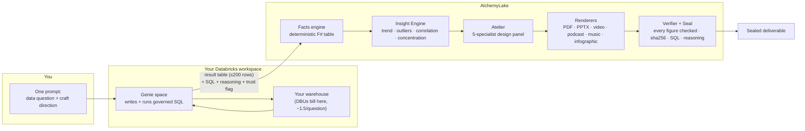
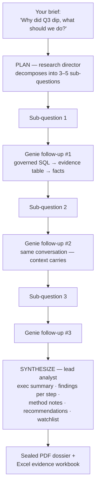

# The Genie Guide — AlchemyLake × Databricks Genie

*Everything about connecting, using, and getting the most out of Databricks
Genie inside AlchemyLake — from first connection to sealed dossier.*

---

## 1. The mental model (read this first)

**Genie is a data source, not a craft.** It never appears in the lane picker
because it lives on the other side of the equation:

- The **left column** of the Studio answers *"where does the data come
  from?"* — samples, your uploads, Unity Catalog tables, **Genie**.
- The **right column** answers *"what do we make from it?"* — Analyst, Deep
  Research, Report, Infographic, Video Briefing, Podcast, Music,
  Presentation.

When Genie is bound, **every** lane draws its data through Genie. You are not
choosing between Genie and AlchemyLake's agents — you are chaining them:

| Stage | Who does it | What happens |
|---|---|---|
| Understand the question | **Genie** (in your workspace) | Reads your prompt against the space's curated schema |
| Write + run SQL | **Genie** (in your workspace) | Governed SQL on your warehouse; data never leaves until the result set returns |
| Derive deterministic facts | **AlchemyLake** | Every number extracted into a facts table (F1, F2, …) |
| Statistical analysis | **AlchemyLake** Insight Engine | OLS trend + R², IQR outliers, Pearson correlations, HHI/Gini concentration, pivots — computed in code, never guessed by an LLM |
| Design + composition | **AlchemyLake** Atelier | Statistician · viz lead · writer · consultant · lane craft specialist deliberate once and return the deliverable spec |
| Rendering | **AlchemyLake** | PDF + evidence workbook, PPTX, animated video, podcast audio, score, infographic |
| Verification | **AlchemyLake** | Every numeric claim checked against the facts table and raw cells; figures substituted deterministically |
| Provenance seal | **AlchemyLake** | sha256 of the exact data, Genie's SQL + reasoning, trusted-asset badge, conversation ids |



**One prompt does both jobs.** The same text is sent to Genie as the question
*and* guides the craft. Write prompts in two parts:

> *"[the data ask] — [the deliverable direction]"*
>
> "Monthly revenue by region for the last 6 quarters — turn it into a
> board-ready video briefing that leads with the strongest region."

If a craft-lane prompt is pure direction ("make it board-ready") and Genie
can't answer it with a data table, the platform automatically **distills a
concrete data question out of your brief and retries once** before failing —
so briefs without an explicit data ask still work. In the Analyst (chat)
lane your message *is* the question, so a miss surfaces directly with a
rephrase hint. Failed runs are never charged credits.

---

## 2. Setup — from zero to bound

### What you need

| Item | Where to get it |
|---|---|
| Databricks workspace URL | e.g. `https://adb-….azuredatabricks.net` |
| Personal access token (PAT) | Databricks → Settings → Developer → Access tokens |
| A Genie space | Databricks → SQL → Genie → create/pick a space; copy its URL |

### Steps (web Studio)

1. **Studio → left rail → Databricks panel → Connect** (or **Edit** on an
   existing connection). Enter host + token.
2. **Paste the full Genie space URL** into the Genie field — the space id is
   extracted automatically. Save.
3. The connection card grows a **◈ Genie Health** button. Run **Check
   Health** — you get a 0–100 curation score with concrete fixes (see §5).
4. Optionally hit **Certify** — real probe questions are replayed through the
   live Genie API and the pass-rate is recorded on the card (see §6).
5. In **Data sources**, a **GENIE** group now shows **◈ Databricks Genie ·
   ask → bind**. Click it to bind. A DBU estimate line appears under the
   bound-source card.

That's it — every craft on the right now flows through Genie.

### The same, in the Databricks App (Streamlit)

The Analyst tab of the Databricks App uses the workspace's own Genie space
and keeps one continuing conversation per session. The Deep Research tab and
the Sources uploader work identically to the web app.

### Who can query — the sharing model (read before rolling out to a team)

Live Genie queries are **per-user, per-connection** by design. A
`genie:<connection>` source resolves only for the AlchemyLake user who owns
that Databricks connection — every question runs in *their* workspace under
*their* token, and another user can never bind it, even with the id in hand.

So: sharing a Genie space with someone **through AlchemyLake alone does not
give them live query access**. What each pattern actually requires:

| You want to share… | Works without Databricks access? | How |
|---|---|---|
| The **deliverables** (sealed PDFs, dossiers, videos, podcasts) | **Yes** | Send the artifact — that's the point of the platform; the seal carries the provenance with it |
| **Live Genie querying** for a teammate | No | Share the space with them in Databricks (space permissions), they connect their own workspace + token in AlchemyLake — two minutes, §2 above |
| The same **curated tables** to someone with no Databricks at all | Yes, via a different door | Export the table and have them **upload** it (CSV/Excel) — every lane incl. Deep Research works on uploads; it's a snapshot, not live SQL |
| One **team account** querying through one shared key | Technically yes, with eyes open | An API key acts as its owning account: renders bill that account's credits and queries run under that account's Databricks token — fine for a bot/service identity, wrong for humans (no per-person governance) |

A first-class "team connection" (one admin-blessed, service-principal-backed
connection that teammates can bind with their own AlchemyLake identities) is
on the future-work list below — it's the correct enterprise answer to this
question, and it doesn't exist yet.

---

## 3. Using it, surface by surface

| Surface | How |
|---|---|
| **Web Studio** | Bind Genie in Data sources → pick a lane → prompt → run |
| **Analyst (chat)** | Follow-up questions continue the **same Genie conversation** — Genie keeps its own context, so "now break that down by region" works. The mapping is per-thread; stale conversations are deleted after 30 days (hygiene sweep, every 6 h) |
| **Databricks App** | Analyst tab (continuing conversation), Deep Research tab, Sources tab |
| **MCP (13 tools)** | Agents (Genie One / Agent Bricks, Claude, Cursor…) call `render_report`, `render_deep_research`, … with `source_id: "genie:<connection_id>"`. Copy-paste config lives in **Developer → ◈ Wire into Genie One / Agent Bricks** |
| **REST API** | `POST /api/public/v1/generations` with `"source_id": "genie:<connection_id>"`; `thread_id` continues a conversation |
| **CLI** | `npx alchemylake render report --source genie:dbx1 --prompt "…"`; `--thread th_…` continues a conversation |

CLI examples:

```bash
# analyst answer through Genie (1 credit + ~1.5 DBU in your workspace)
alchemylake render chat --source genie:dbx1 \
  --prompt "Top 10 customers by ARR this fiscal year"

# follow-up in the SAME Genie conversation
alchemylake render chat --source genie:dbx1 --thread th_abc123 \
  --prompt "Now show their year-over-year change"

# a full deep-research dossier, evidence gathered step-by-step via Genie
alchemylake render deep_research --source genie:dbx1 \
  --prompt "Why did Q3 margin compress and what should we do about it?"
```

---

## 4. What you can create (the eight lanes × Genie)

| Lane | Credits | What Genie feeds it | What you get |
|---|---|---|---|
| Analyst | 1 (6 with council) | One governed answer table per question; conversation continues across follow-ups | Verified prose answer, every figure sealed |
| Deep Research | 18 | 3–5 sub-questions, each a follow-up in **one** Genie conversation | Sealed PDF dossier + Excel evidence workbook |
| Report | 10 | The result table of your prompt's data ask | Enterprise PDF (cover, KPI band, charts, appendix) + evidence workbook |
| Presentation | 40 | Same | PPTX with real charts, verbatim speaker notes, Q&A prep |
| Infographic | 45 | Same | Designed data poster, stats composed by the panel |
| Video Briefing | 40 | Same | Animated data video (up to ~9 scenes), narrated, real charts |
| Podcast | 25 | Same | Two-host audio briefing (up to ~22 turns) + transcript |
| Music | 50 | Same | Sonified score — tempo from momentum, key from trend |

*(Credits are the platform defaults from the rate card; Admin → Rates is the
live truth.)*

---

## 5. The health score, explained

Genie answers only as well as its space is curated. **The score grades your
space's curation in Databricks — not AlchemyLake.** Four dimensions, 100
points:

| Dimension | Max | How it's scored |
|---|---|---|
| Column descriptions | 40 | % of exposed columns carrying business descriptions. If the API doesn't expose column metadata, a neutral 20 is given (we don't zero you on API opacity) |
| General instructions | 20 | All-or-nothing: does the space carry business definitions, metric rules, vocabulary? |
| Example questions | 25 | 5+ examples → full marks; fewer → partial (10 + 3 per question); none → 0 |
| Space completeness | 15 | Title (8) + description (7) |

**A worked example — a score of 28:** columns not inspectable (20) + no
instructions (0) + no example questions (0) + title but no description (8)
= **28/100**. The fixes listed under the bar are the exact missing points.

**Raising it** (all done in Databricks → your Genie space → editor):

1. Add **descriptions to every exposed column** — Genie leans on them to
   disambiguate ("revenue" vs "recognized revenue").
2. Add **general instructions** — your metric definitions, fiscal calendar,
   domain vocabulary.
3. Add **5+ example questions with reviewed SQL** — they anchor Genie to your
   intended query patterns and enable **trusted answers** (see §8).
4. Give the space a **description**.

Then hit **Check Health** again. This loop — score, fix, re-score — is
tooling *on top of* Genie that Databricks itself doesn't ship.

---

## 6. Certification, explained

**Certify** is a live fire drill. It:

1. Takes up to 5 of the space's own example questions (or, if the space has
   none, 3 generic analytical probes — which is why an uncurated space
   certifies against generic questions).
2. Replays each through the **real** Genie conversation API.
3. Counts a pass when the answer comes back with an actual data table.
4. Stores the pass-rate + timestamp on the connection (the green
   `✓ certified 2/3 probe questions (67%)` line) and deletes the probe
   conversations afterwards.

Re-certify after every meaningful curation change. A certified badge means
"a real question got a real governed answer from this space today" — evidence
you can show a stakeholder, not a promise.

---

## 7. Costs — the two meters

| Meter | What | Billed where |
|---|---|---|
| **AlchemyLake credits** | The lane price (1–50 cr, table in §4) | Your AlchemyLake balance |
| **Databricks DBUs** | ~1.5 DBU ≈ $0.11 per Genie question | **Inside your own workspace** — never through AlchemyLake |

Notes:

- Databricks' Genie meter gives the **first 150 DBUs/user/month free**, so
  casual use often costs nothing workspace-side.
- A Deep Research run asks 3–5 Genie questions (one per sub-question), so
  budget ~5–8 DBU workspace-side for one dossier.
- The estimate line under the bound source card is exactly this reminder.

---

## 8. Why AlchemyLake on top of Genie (and when plain Genie is enough)

### What Genie alone gives you

A very good conversational SQL analyst *inside* Databricks: ask a question,
get a table and a basic chart, in a chat UI, for people who have workspace
access.

### What AlchemyLake adds on top

| Capability | Genie alone | AlchemyLake × Genie |
|---|---|---|
| Answer format | Table + basic chart in a chat UI | Sealed PDF dossier, evidence workbook, PPTX with speaker notes, animated video, podcast, infographic, score |
| Statistical depth | What the SQL returns | Deterministic Insight Engine on top: trend + R², IQR outliers, Pearson correlations, HHI/Gini concentration, pivots |
| Number integrity | LLM narrates freely | Every numeric claim verified against the facts table + raw cells; figures substituted deterministically ({{F#}}) — no hallucinated numbers |
| Provenance | Conversation history | Audit-grade seal: sha256 of the exact data, the SQL, Genie's reasoning, trusted-asset badge, conversation ids |
| Multi-step investigation | One question at a time | Deep Research: planned sub-questions, each answered with evidence in one continuing conversation, synthesized dossier |
| Audience | Needs a Databricks login | Deliverables for people with **no** workspace access — board, clients, field teams get a PDF/video/podcast |
| Automation | Conversation API | MCP tools for agents, REST API, CLI, one-click recipes, scheduled living deliverables |
| Space quality tooling | — | Health score with concrete fixes + live certification |
| Mixed data estates | Databricks only | The same eight lanes work on plain CSV/Excel/PDF uploads — one workflow whether or not a team has Databricks |
| Brand | — | Your logo, voice, and styles on every artifact |

### The best scenarios for AlchemyLake × Genie

1. **The board pack** — "Q3 revenue by segment — board-ready report" →
   governed SQL + sealed PDF + evidence workbook, in one run.
2. **The why investigation** — Deep Research decomposes "why did margin
   compress?" into sub-questions, gathers governed evidence per step, and
   ships a dossier with method notes.
3. **The non-Databricks audience** — a weekly video briefing or podcast from
   live lakehouse data, consumable by people who will never log into
   Databricks.
4. **The agent pipeline** — Genie One / Agent Bricks (or any MCP agent) calls
   `render_report` against your Genie source: governed data → finished
   deliverable with zero human clicks.
5. **The curation loop** — score the space, fix, certify, and prove to
   stakeholders that "certified 5/5 today" before rolling Genie out wider.

### When plain Genie is the right tool

Honest answer: a quick ad-hoc lookup by a data-literate user inside the
workspace — "what was yesterday's GMV?" — needs no credits, no artifact, no
seal. Use the Genie space directly. Reach for AlchemyLake when the answer has
to **become something**: verified, sealed, designed, multi-step, scheduled,
or consumed by someone outside Databricks.

---

## 9. Deep Research × Genie (how the 18 credits work)



Every sub-question is a follow-up message in **one** Genie conversation, so
Genie's own context accumulates across steps. All evidence tables fold into
one fact list, and the final verification pass covers every number from every
step. The live trace shows each step as it happens.

The same lane works without Databricks at all — for uploads/UC/samples the
evidence executor is the platform's deterministic facts engine instead of
Genie. Same dossier, same seal, different retrieval.

---

## 10. Trust, feedback, and hygiene

- **Provenance seal** — every Genie-bound result stores: space id,
  conversation + message ids, Genie's own reasoning, the generated SQL, a
  sha256 of the exact rows the model saw, and the bind timestamp.
- **Trusted-asset badge** — when Genie answers from a curator-reviewed
  example query or trusted asset, the seal says so: the SQL itself was
  human-blessed, not just the numbers verified. (Another reason to add
  example questions with reviewed SQL — §5.)
- **Feedback loop** — thumbs up/down on any Genie-bound result forwards to
  Genie's own feedback endpoint. The signal trains **your** space's curation
  loop, exactly where it belongs.
- **Retention hygiene** — Genie spaces cap at 10,000 conversations.
  AlchemyLake deletes conversations idle for 30+ days (server-side in your
  workspace, then locally), sweeping every 6 hours. Certification probes are
  deleted immediately after the run.
- **Ownership** — a Genie source id encodes its connection
  (`genie:<connection_id>`) and only resolves for the owning user's *active*
  connection. Disconnecting the workspace instantly stops it resolving
  anywhere, even for an id a client already holds.

---

## 11. Troubleshooting

| Symptom | Cause | Fix |
|---|---|---|
| "Genie couldn't turn this brief into a data table" | Neither your prompt nor the auto-distilled question produced rows the space can answer | Lead with a concrete ask the space's tables can satisfy: "revenue by region last 6 months — then the craft direction" |
| "Genie answered without a tabular result" (Analyst) | Your chat message wasn't a data question | Rephrase with a concrete ask: "revenue by region last 6 months" |
| Run fails with "source unavailable" | Token expired, space deleted, or connection made inactive | Re-test the connection; re-paste the space URL |
| Answers feel generic or wrong | Low curation (check the health score) | Apply the §5 fixes in the space editor; aim above 70 |
| Follow-up loses context | Different thread (new Analyst session = new thread) | Continue in the same session; via API/CLI pass the same `thread_id` |
| Certify passes fewer than expected | Probes are generic because the space has no example questions | Add 5+ example questions; re-certify against your real workload |
| No "Genie Health" button on the card | Connection has no Genie space id | Edit the connection and paste the space URL |
| Unexpected workspace cost worries | DBUs bill in your workspace per question | ~1.5 DBU (~$0.11)/question; first 150 DBUs/user/month free |

---

## 12. Where everything lives

| Thing | Where |
|---|---|
| Connect / edit workspace + Genie space | Studio → Databricks panel |
| Health score + Certify | The connection card → ◈ Genie Health |
| Bind Genie as source | Studio → Data sources → GENIE group |
| DBU estimate | Under the bound-source card in the Crucible |
| Live step trace | Under the progress line during Genie / Deep Research runs |
| Seal (reasoning · SQL · trusted badge · feedback) | On every Genie-bound result |
| Agent config (MCP) | Developer → ◈ Wire into Genie One / Agent Bricks |
| API key for CLI/REST | Developer → MCP & keys |
| Databricks App | Your workspace → Apps → AlchemyLake (Analyst · Deep Research · Sources tabs) |
| Docs | app.alchemylake.com/docs (§ Databricks, § lanes, § developers) |

---

## 13. Future work — the Genie ecosystem we haven't tapped yet

What AlchemyLake uses today is Genie's **conversation surface**: start /
follow-up / poll / query-result, feedback, conversation deletion, and the
space-metadata read that powers health scoring. Databricks ships more around
Genie and Genie One / Agent Bricks than that, and the platform's own sharing
model has one known gap. Candidates, roughly in value order — none committed:

1. **Team connections (the sharing gap, §3).** One admin connects a
   workspace via a **service principal**, marks the connection shared, and
   teammates bind it under their own AlchemyLake identities — per-person
   credits, audit, and feedback, one blessed credential. On the Databricks
   App side, the same via **on-behalf-of-user auth**, so queries run as the
   actual person clicking, not the app's principal.
2. **Apply-fix curation loop.** Health today *tells* you what's missing;
   Genie's space-management APIs would let AlchemyLake *apply* the fix from
   the health card — write the space description, add an example question
   with reviewed SQL (seeded from thumbs-up results), push column comments
   to Unity Catalog. Score → fix → re-score without leaving the Studio.
3. **Benchmark-grade certification.** Replace/augment the probe replay with
   Genie's own **benchmarks** (curated question + expected answer sets):
   scheduled runs, pass-rate trend over time, regression alerts when a space
   edit or data change breaks previously-passing questions.
4. **Multi-space routing.** Accounts with several Genie spaces get one
   "Ask Genie" source that routes each question (or each Deep Research
   sub-question) to the best space — cross-domain dossiers from finance +
   ops + product spaces in a single run.
5. **Trusted-asset authoring from feedback.** A thumbs-up on a Genie result
   whose SQL a curator then reviews becomes a one-click "promote to example
   question / trusted asset" — closing the loop from usage to curation.
6. **Deeper Genie One / Agent Bricks integration.** Today agents in Genie
   One call AlchemyLake's MCP tools (the wizard). The inverse and the
   ensemble are open: AlchemyLake calling a customer's **Agent Bricks**
   agents as evidence executors in Deep Research, and a packaged
   multi-agent supervisor recipe (Genie for data + Knowledge Assistant for
   documents + AlchemyLake for sealed deliverables).
7. **Databricks One surface.** Publish finished dossiers/briefings back into
   the workspace where executives already live — a Volumes folder with a
   One-visible index, or embedding links on the space's page.
8. **Scheduled Genie research.** Living deliverables already re-render on a
   cadence; wiring cadence + Deep Research + a Genie space gives "every
   Monday, investigate last week's anomalies and ship the dossier" — with
   drift alerts when this week's numbers break from the trend.
